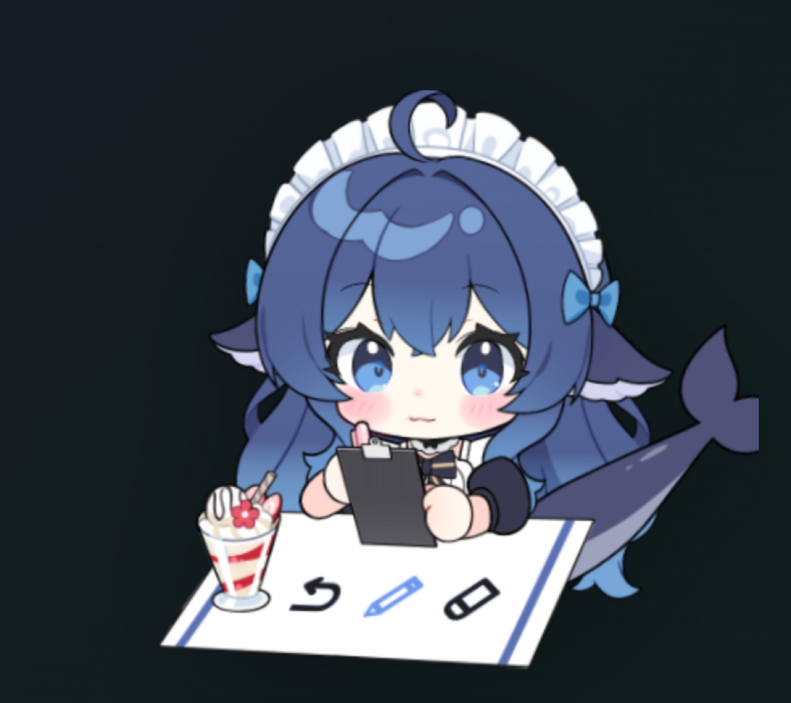

<div align="center">

# 🐋 鲸鱼娘桌宠 · Whale Girl Live2D

**DSH（DeepSeek Harness）Web 界面里的 Live2D 桌宠 —— 她真的在跟着 agent 干活。**
**A Live2D desktop pet for the DeepSeek Harness Web UI — she really does follow what the agent is doing.**

[](https://github.com/Andersen216/dsh-whale-girl-live2d/releases)
[](LICENSE)
[](NOTICE.md)
[](NOTICE.md)
[](#-安装--install)



点一下就能跟 agent 说话 · 右键就是钱包 · 表情 / 装饰 / 场景 / 动作 四页菜单 · 拖动换位置

</div>

---

## 🖥 两种用法：网页版 / 桌面版（macOS）

**先看这张表，选一个再往下看**（两个可以同时用，也可以只用其中一个）：

| | 🖥 **网页版**（主线 · 推荐） | 🐋 **桌面版**（macOS 附加） |
| --- | --- | --- |
| 她住在哪 | DSH Web 界面右下角（浏览器里） | **你的桌面上**：独立透明窗口，切桌面/开全屏她都在 |
| 支持平台 | **Windows / macOS / Linux** | **只有 macOS 13+** |
| 怎么装 | **只装插件**（见下面「安装」） | **① 先装插件 → ② 再下载桌面 App** |
| 要不要开着浏览器 | 要（她在那张标签页里） | **不用**，浏览器关了也在；DSH 在跑就行 |
| 额外能力 | — | 点击穿透（不挡干活）· 拖她=拖窗口 · **贴边悬浮小球** · 菜单栏 🐋 · 设置里「彻底关闭 App」 |
| 谁适合 | 大多数人、非 Mac 用户 | 想把桌宠真放到桌面上、并且用 Mac 的人 |

> **它们是两层，不是两个版本**：模型、联动、菜单、钱包全在插件里（网页版那份），
> 桌面 App 只是把同一个页面装进一个原生窗口。所以插件升级，两边同时受益。

**桌面版怎么下载**：去 [Releases](https://github.com/Andersen216/dsh-whale-girl-live2d/releases)
下 `DS-WhaleGirl-Pet-macOS-*.zip`，解压把 `DS 鲸鱼娘桌宠.app` 拖进「应用程序」即可。
完整说明（含「必须先把插件装好」这一步、自己编译的方法、两个技术坑）见
[`desktop/README.md`](desktop/README.md)。

---

## 🚀 安装（网页版）/ Install the web version

> **先确认一件事**：你机器上已经装好 DSH（DeepSeek Harness）。终端里敲 `dsh --version` 有输出就说明没问题；
> 没装的话先装 DSH，再回来装这个桌宠。

### 方式 A：命令行装（推荐，一条命令）

```bash
dsh plugin --profile web add github:Andersen216/dsh-whale-girl-live2d
```

- `--profile web` 是 DSH Web 界面的 profile 名。如果你用的是别的 profile 名，把 `web` 换成你自己的。
- 这条命令会从 GitHub 拉取插件并注册进 profile（需要能访问 GitHub）。

### 方式 B：手动下载 ZIP（不想用命令行 / 公司网络限制 git）

1. 打开仓库页面 → 绿色 **Code** 按钮 → **Download ZIP**
2. 解压到一个**你能记住的目录**，例如：
   - macOS / Linux：`~/Documents/dsh-whale-girl-live2d-main`
   - Windows：`C:\Users\你的用户名\Documents\dsh-whale-girl-live2d-main`
3. 用 **绝对路径**装（`link:` 后面必须是绝对路径；**有空格一定要加引号**）：

```bash
# macOS / Linux
dsh plugin --profile web add "link:/Users/你的用户名/Documents/dsh-whale-girl-live2d-main"
```

```powershell
# Windows（PowerShell / CMD 都可以）
dsh plugin --profile web add "link:C:\Users\你的用户名\Documents\dsh-whale-girl-live2d-main"
```

### 方式 C：从 DSH 插件市场装

等本插件被 [DSH 插件市场](https://github.com/awesome-dsh-plugin/awesome-dsh-plugin) 收录后，
在界面的插件中心搜 **`鲸鱼娘`**、**`whale-girl`** 或 **`live2d`** 就能一键安装（收录进度见下方「相关链接」）。
**现在还没收录**，先走方式 A 或 B。

### 装完必须做两步（少一步都不会出现）

1. **重启 DSH**（宿主插件只在启动时加载）：把正在跑的 `dsh web` 停掉，重新起一次
2. **刷新页面**（强刷 `Cmd+Shift+R` / `Ctrl+F5`）

装成功后，界面右下角会出现鲸鱼娘。

### 一行自检

浏览器打开：**`http://127.0.0.1:3080/dsh-pet/pet.js`**

| 看到 | 意思 |
| --- | --- |
| **401** | ✅ 插件已挂载（被 DSH 的信任栅栏挡着，这是正常的） |
| **404** | ❌ 插件没被加载 —— 看下面的「排错」 |
| 满屏 JS 代码 | ✅ 也已经挂载了（你的 DSH 没开信任栅栏） |

### 更新 / 卸载

```bash
# 更新到最新版（更新完同样要重启 DSH + 刷新页面）
dsh plugin --profile web update dsh-whale-girl-live2d

# 卸载
dsh plugin --profile web remove dsh-whale-girl-live2d
```

<details>
<summary><b>🇬🇧 English — Install</b>（点开）</summary>

**Requirements**: DSH (DeepSeek Harness) already installed — `dsh --version` should print something.

**Option A — one command (recommended)**

```bash
dsh plugin --profile web add github:Andersen216/dsh-whale-girl-live2d
```

`web` is the profile name used by the DSH Web UI; replace it if your profile is named differently.
This pulls the plugin from GitHub and registers it in that profile (needs GitHub access).

**Option B — download the ZIP** (no command line / git blocked): click **Code → Download ZIP**, unzip it
anywhere, then install it by **absolute path** (quote it — especially on Windows or with spaces):

```bash
dsh plugin --profile web add "link:/absolute/path/to/dsh-whale-girl-live2d-main"
```

**Option C — from the DSH plugin market**: once the plugin is listed, search for `whale-girl` or `live2d`
in the plugin center and install with one click. *It is not listed yet* — use A or B for now.

**After installing, two steps are mandatory**: ① **restart DSH** (host plugins load at startup), ② **reload
the page** (hard reload: `Cmd+Shift+R` / `Ctrl+F5`). She appears in the bottom-right corner.

**One-line check**: open `http://127.0.0.1:3080/dsh-pet/pet.js` — **401** means loaded (the trust gate is
doing its job), **404** means not loaded (see Troubleshooting).

**Update / remove**

```bash
dsh plugin --profile web update dsh-whale-girl-live2d   # then restart DSH + reload
dsh plugin --profile web remove dsh-whale-girl-live2d
```

</details>

---

## 🎮 一分钟上手 / Quick start

| 你想干嘛 | 怎么做 |
| --- | --- |
| **跟她说话 / 给 agent 发消息** | 点工具栏的 **「说话」** 打开输入框（**再点一次就关**），`Enter` 发送、`Shift+Enter` 换行；回复会逐字冒进气泡里。旁边「打断」可以中止当前这一轮 |
| **摸摸她** | 直接点她（上半身和下半身反应不一样；连着猛点会炸毛，这是设计） |
| **换表情 / 换装 / 摆场景 / 演小动作** | 点工具栏的 **`⋯`**，菜单分四页（见下方「菜单」） |
| **看余额 / 本轮花了多少** | **右键点她**，弹出钱包（再按一次右键、点 ×、点别处或按 `Esc` 都能收） |
| **挪位置** | 直接拖。松手时：靠左/右墙就吸过去，**竖直位置保持你放的高度**；离两侧都远就停在原地 |
| **藏起来** | 点工具栏的 **`–`**，右下角留个小把手，点一下就叫回来 |
| **一键重置** | 菜单 →「设置」→「一键重置所有状态」：表情、道具、场景、动作全部回到最初的「本子 + 笔 + 平常脸」 |

<details>
<summary><b>🇬🇧 English — Quick start</b></summary>

- **Talk to the agent**: click **「说话」/ Speak** in the toolbar to open the input box (click it again to
  close it). `Enter` sends, `Shift+Enter` is a newline; the reply streams into a speech bubble. The
  **「打断」/ Interrupt** button cancels the current turn.
- **Pet her**: just click her (upper and lower body react differently; clicking fast repeatedly makes her
  snap — that is intentional).
- **Expressions / dress-up / desk scenes / one-shot animations**: click **`⋯`** in the toolbar.
- **Balance & turn cost**: **right-click her** — a wallet HUD appears (right-click again, click ×, click
  elsewhere, or press `Esc` to close).
- **Move her**: drag. On release she snaps to the left/right wall if close enough; the vertical position
  stays exactly where you put her.
- **Hide**: click **`–`**; a small handle stays in the bottom-right corner to bring her back.
- **Reset everything**: menu → Settings → "Reset all state".

</details>

---

## ✨ 这是什么 / What is this

**中文**

把 Live2D 模型「鲸鱼娘」挂进 DSH 的 Web 界面。她常驻在桌面角落，**不是一张静态贴图**——
她在跟着 **agent 的真实状态**动：思考时低头、查资料时戴上眼镜掏出手机、逐字输出时嘴巴跟着动、
报错时黑一下脸、一轮收工就伸懒腰庆祝。

和「一张 PNG 加气泡文案」的挂件不同：这是活的 Live2D —— **44 个表情、8 个动作**、物理摆动、视线跟随，
而且由**真实的事件流**驱动（不是轮播动画）。所有小动作都照**模型作者自己的按键表**来
（52 条热键逐条对照，见 [`docs/作者按键表-对照.md`](docs/作者按键表-对照.md)），所以互不冲突、
不会互相覆盖、到点自己收回。

**English**

Whale Girl Live2D puts a Live2D model — the DeepSeek whale girl — inside the DSH Web UI. She lives in a
corner of the screen and is **not a static sticker**: she follows **what the agent is actually doing**,
tilting her head while thinking, putting on glasses and pulling out a phone when the agent reads or
searches, moving her mouth as text streams in, darkening her face when a tool errors, and stretching in
celebration when a turn finishes. Unlike a PNG-with-a-bubble widget this is real Live2D: **44 expressions,
8 motions**, physics, gaze tracking — driven by the **real event stream**, not an animation loop. Every
one-shot action is mapped from the **original model author's own hotkey sheet** (52 hotkeys, item by item —
see [`docs/作者按键表-对照.md`](docs/作者按键表-对照.md)), so nothing overlaps and everything expires on its own.

### 🧠 她跟 agent 的联动 / What she reacts to

| agent 在干什么 | 她的反应 |
| --- | --- |
| 主人在说话 / 正在思考 | 星星眼听着 / 低头想事，手里是本子 + 笔 |
| 调用工具 | 按工具换脸换动作：读文件 = 戴眼镜凑近看，上网 = 掏出手机，写文件 = 奋笔疾书，跑命令 = 挽袖子 |
| 逐字输出回复 | 气泡逐字冒字 + 走路般的小幅度摆动 |
| 工具报错 / 整轮失败 | 黑一下脸（很短，不砸东西）；成功收工 = 伸懒腰 + 比耶 + 用时 / 花费统计 |
| 长时间没动静 | 她自己会动：换视线、换个表情几秒、自言自语、喊饿 |

> **English**: thinking → head down with notebook and pen; tool calls → face and motion follow the tool
> (reading = glasses, web search = phone, writing = scribbling, shell = rolled-up sleeves); streaming text
> → mouth moves, bubble fills letter by letter; tool error → she darkens for a moment; turn finished →
> stretch, peace sign and a stats bubble; idle for a long time → she glances around, changes expression for
> a few seconds, mutters to herself or complains she is hungry.

---

## 🎭 菜单：表情 / 装饰 / 场景 / 动作

点 `⋯` 打开的菜单有四页，**每页守一条不同的规矩**：

| 页 | 内容 | 生命周期 |
| --- | --- | --- |
| **表情** | 按表情去重的一张脸（16 个按钮） | **临时**：点了演 3~4 秒，自己让位；平常状态永远是**平常脸**；期间她自己的表情 / agent 事件 / 你再点一个都会把它顶掉 |
| **装饰** | 眼镜、贴纸、花花、发箍、单边马尾、头顶鲸 | **常驻**：戴上就留着，再点一下摘掉（同类互斥：眼镜只戴一副、贴纸只贴一张） |
| **场景** | 深色桌布、鲸鱼放桌上、巴菲、粉 / 白魔爪、掏出手机、手机换色 | **常驻**：摆着不走，再点一下收 |
| **动作** | 猫爪摆手、喵喵手、比耶、冒爱心、心跳、MoeMoeQ~、橡皮、撤回、蛋包饭、自拍、快速自拍、喷水 | **一次性**：演一遍就消失，绝不写进常驻层 |

> **English**: four tabs with four different lifetimes — **Expressions** are temporary (3–4 s, then she
> hands her face back to the motions); **Accessories** and **Scenes** are persistent (toggle on/off, one
> per category); **Actions** are one-shot (they play once and clean themselves up). The omurice action is
> the special case: it is an expression plus the ketchup-squeezing motion, and it disappears right after
> the sauce is squeezed.

**永久移除**（代码里也拦死了 `BANNED_MOTIONS`，菜单里找不到）：吹泡泡糖、大锤砸、呆呆眼、圈圈眼。

**工作优先级高于互动**：干活时点她**不打断**——不改脸、不放动作，最多弹一下表示「知道了」。

---

## 💰 右键 = 钱包（余额 / 本轮消耗 / 峰谷计价）

| 显示 | 说明 |
| --- | --- |
| **剩余余额** | DeepSeek 官方 `user/balance` 接口。key 从 DSH 的凭据服务读（`DEEPSEEK_API_KEY`），读不到就显示「未配置」 |
| **本轮消耗** | 每轮结束**自动弹出来**：金额 + tokens（按命中 / 未命中 / 输出三个口径分别计价） |
| **今日已用** | 当天累计（按北京时间分日） |
| **峰 / 谷** | **峰 = 红，谷 = 绿**。高峰 = 北京时间周一至周五（不含法定节假日）9:00–12:00、14:00–18:00；其余（含周末、法定节假日）都是谷价 |
| **距切换** | 距离下一次峰谷切换还有多久（每秒刷新，跨过切换点自动重拉余额） |

- 计价用 Flash 价目（命中 0.02 / 未命中 1 / 输出 4 元每百万 token，高峰 = 空闲 ×2）；换 Pro 模型自动按 3 倍算。
- **不跟对话抢屏幕**：开菜单时 HUD 自动收起；鼠标停在 HUD 上时不会被自动收起；自动弹出的那次 9 秒后自己收。
- **不依赖别的插件**：余额 / 峰谷 / 记账都是这个插件宿主自己算的；两个数据源都没有时显示「读不到余额接口」，不假装有数。

> **English**: right-click her for a wallet HUD: remaining balance (DeepSeek's official `user/balance`
> endpoint, key read from DSH's credential service), this turn's cost (auto-popped when a turn ends, with
> hit / miss / output token tiers), today's total, and peak / off-peak pricing (**peak = red, off-peak =
> green**; peak hours are Mon–Fri 09:00–12:00 and 14:00–18:00 Beijing time, holidays excluded). It never
> fights the chat for screen space, and it works without any other plugin installed.

---

## 🤖 让 agent 主动指挥她 / Agent control

装好之后，agent（或者你自己）可以用命令行指挥她：

```bash
cd <你放插件的目录>/dsh-whale-girl-live2d

node tools/pet-ctl.mjs status          # 她在不在、当前会话、连接数
node tools/pet-ctl.mjs mood happy      # 换情绪
node tools/pet-ctl.mjs expr 星星眼      # 直接指定表情
node tools/pet-ctl.mjs motion selfie   # 播动作
node tools/pet-ctl.mjs say "搞定了！"   # 弹一句话
node tools/pet-ctl.mjs prop 猫猫贴纸 on # 戴道具
node tools/pet-ctl.mjs ask "要继续吗？" # 弹话 + 打开面板提醒你
```

底层就是一个本地 HTTP 接口，也可以直接打：

```bash
curl -X POST http://127.0.0.1:3080/dsh-pet/control \
  -H 'Content-Type: application/json' \
  -d '{"mood":"happy","motion":"selfie","say":"你好呀"}'
```

浏览器控制台里还有 `DSHPet` 对象可以直接玩：

```js
DSHPet.state              // 当前状态
DSHPet.setMood('angry')   // 换脸
DSHPet.playMotion('selfie')
DSHPet.setProp('glassesSun', true)
DSHPet.hitTest(x, y)      // 这个坐标算不算点在它身上
```

<details>
<summary><b>🇬🇧 English — Agent control</b></summary>

The host exposes a small local HTTP API, so an agent (or you) can drive her directly:
`GET /dsh-pet/state`, `GET /dsh-pet/events` (SSE), `POST /dsh-pet/say` `{text}`,
`POST /dsh-pet/cancel`, `POST /dsh-pet/control` `{mood, expr, motion, prop, say}`,
`GET /dsh-pet/standalone` (pet-only page). `tools/pet-ctl.mjs` is a thin CLI over the same endpoints.
A `DSHPet` object is also exposed in the browser console (see the code block above).

</details>

---

## 🩺 排错 / Troubleshooting

**先做这一步**：打开 **`http://127.0.0.1:3080/dsh-pet/diag`** —— 一条 URL 把启动过程、模型尺寸、
取景结果、可用表情 / 动作、被过滤的参数全列出来。出问题截图这一页就够定位了。

| 现象 | 原因 | 怎么办 |
| --- | --- | --- |
| `dsh: command not found` | DSH 没装或没进 PATH | 先装好 DSH；临时可用 `npx @deepseek-ai/dsh plugin --profile web add ...` |
| **照着旧教程 `link:` 装，报路径不存在** | 教程里写的是**别人的**（作者的）本机路径 | `link:` 后面必须是**你自己机器上的绝对路径**，指向你解压出来的目录；路径有空格要加引号 |
| 装完刷新页面什么都没有 | **宿主插件要重启 DSH 才加载** | 重启 DSH（`dsh web` 那个进程），再刷新页面 |
| 重启后还是没有 | 启动日志里有 `dsh-whale-girl-live2d` 的报错 | 多半是 `cordis.patch.yml` 的 `name:` 与包名不一致（本仓库已一致，改过就别动） |
| 连 `/dsh-pet/pet.js` 都 404 | 插件没被注册进 profile | 检查 profile 的 `package.json`：`dependencies` 和 `dsh.profile.bundles` 里都要有 `dsh-whale-girl-live2d` |
| **更新了但版本号没变** | pnpm 按 lockfile 记住了上次解析的 commit | `dsh plugin --profile web remove dsh-whale-girl-live2d` 再 `add` 一次；或 `dsh plugin --profile web install --force` |
| 桌宠挡住按钮 / 想换个大小 | — | 拖动挪开、点 `–` 藏起来；大小和取景在菜单 →「设置」里 |
| 她一直不动 | 没有会话在干活（她本来就是「平时不动」的设计） | 打开一个对话发一句话，或者 `node tools/pet-ctl.mjs motion selfie` 试一下 |

<details>
<summary><b>🇬🇧 English — Troubleshooting</b></summary>

| Symptom | Cause | Fix |
| --- | --- | --- |
| `dsh: command not found` | DSH not installed / not on PATH | Install DSH first; or use `npx @deepseek-ai/dsh plugin --profile web add ...` |
| `link:` install fails with "path does not exist" | the path in a tutorial was **someone else's machine** | `link:` needs **your own absolute path** to the folder you unzipped; quote it if it has spaces |
| Nothing appears after install | **host plugins only load when DSH restarts** | restart DSH, then reload the page |
| Still nothing after restart | an error in the DSH startup log | usually a `name:` mismatch in `cordis.patch.yml` |
| `/dsh-pet/pet.js` returns 404 | plugin not registered in the profile | the name must appear in both `dependencies` and `dsh.profile.bundles` of the profile's `package.json` |
| Updated but the version did not change | pnpm resolved the old commit from the lockfile | remove and re-add the plugin, or run `dsh plugin --profile web install --force` |
| She never moves | no session is working (that *is* the idle design) | send a message in a chat, or try `node tools/pet-ctl.mjs motion selfie` |

Diagnostics page: `http://127.0.0.1:3080/dsh-pet/diag`.

</details>

---

## ⚙️ 配置 / Config

默认值写在 `lib/index.js` 的 `DEFAULT_CONFIG`；用户覆盖写在 **`~/.dsh/dsh-live2d-pet.json`**
（文件名沿用旧名，改它会读不到，别改）：

```json
{
  "enabled": true,
  "height": 340,
  "corner": "br",
  "lookAtCursor": true,
  "talkMouth": true,
  "sleepAfterMs": 180000,
  "showReasoning": false
}
```

`enabled: false` 会连注入脚本一起去掉（改完要重启 DSH）。

> **English**: defaults live in `DEFAULT_CONFIG` in `lib/index.js`; override them in
> `~/.dsh/dsh-live2d-pet.json` (the filename intentionally keeps the old name). Changing `enabled` requires
> a DSH restart.

---

## 🔧 它内部是怎么动的 / How it works

模型这套资产原本是给 VTube Studio 用的：44 个「表情」其实是 44 组参数开关（全是 Add 混合），
`model3.json` 里连 `Motions` 段都没有。所以做了三件事：

1. **补 `model3.json`**：把 8 个动作按独立 group 注册进去，标准 Live2D 运行时才播得动
   （`tools/build-model.mjs` 生成，可重跑）。
2. **自己写 rig，不用框架的 expressionManager**：挂在 `InternalModel` 的 `beforeModelUpdate` 上——
   那是 `model.update()` 之前的最后一站，动作 / 眨眼 / 视线 / 物理都已经算完，我们加的参数一定生效；
   而每帧结尾 `loadParameters()` 会把参数还原，所以写入不跨帧累积。情绪（互斥）和道具（粘性）分开管；
   权重降到 0 的表达式不再写参数，把脸交还给动作，这样「伸展」「自拍」这些自带表情的一次性动作
   才不会被抹平成面瘫。
3. **命中判定用 alpha 掩码**，不是包围盒：这个模型是一整张书桌场景，包围盒里大半是空气，
   点空气要让事件穿透到下面的 DSH 界面。

事件侧：宿主监听 `ctx.on('session/event')`（轮次 / 步骤 / 工具 / 最终消息）和
`ctx.on('agent/assistant-stream')`（**真正的逐字流**），过滤出「人正在用的那个会话」后用 SSE 推给前端；
反向用官方的 `sessionController.prompt()`，跟你在界面上打字是同一条路。

> **English**: the artwork was authored for VTube Studio, so the repo adds a `model3.json` with the eight
> motions registered as proper groups, drives parameters from a hand-written rig hooked onto
> `InternalModel`'s `beforeModelUpdate` (mood = exclusive, props = sticky; expressions at weight 0 stop
> writing so one-shot motions keep their own faces), and hit-tests against an alpha mask instead of a
> bounding box so clicks on empty air fall through to the UI. The host bridges real agent events
> (`session/event`, `agent/assistant-stream`) over SSE, and sends messages back through the official
> `sessionController.prompt()`.

---

## ⚠️ 已知限制 / Known limitations

- **模型里有两处参数引用是坏的**（原作者的遗留）：`喵喵手~喵~动画` 引用了模型里不存在的
  `ParamCheek51` / `ParamCheek61`；`番茄酱` 动作引用了 `keyboard` / `xbox`。
  前端启动时会自动过滤掉并在控制台说明。
- 桌宠显示在 DSH Web 页面里；**关掉页面它就没了**。想要常驻桌面可以用
  `/dsh-pet/standalone` + `open -na "Google Chrome" --args --app=http://127.0.0.1:3080/dsh-pet/standalone`。
- 模型没有音频资源，所以 `config.sound` 目前是占位，没有实现。

---

## 📁 目录结构 / Layout

```
dsh-whale-girl-live2d/
├── package.json             DSH bundle 插件元数据（dsh.bundle.patch）
├── cordis.patch.yml         挂载声明
├── screenshots.json         插件市场详情页用的截图清单
├── lib/index.js             宿主侧：静态资源 + SSE 事件桥 + prompt 反向通道 + 自检页
├── assets/
│   ├── pet.js               前端本体：Live2D 渲染 / 情绪 rig / 状态机 / 气泡 / 输入框
│   ├── vendor/              Live2D Cubism Core · PIXI 6.5.10 · pixi-live2d-display 0.4.0
│   └── model/               模型本体 + 由 tools/build-model.mjs 生成的清单
├── tools/
│   ├── build-model.mjs      把 VTube Studio 原始素材整理成可消费的形态
│   ├── preview-server.mjs   脱离 DSH 的预览 + 假 agent 事件发生器
│   ├── pet-ctl.mjs          agent / 命令行驱动桌宠
│   ├── smoke.mjs            浏览器内功能自检
│   └── shot.mjs             CDP 截图
├── docs/                    截图、作者按键表对照、发布说明
└── skill/SKILL.md           给 agent 看的用法说明，装到 ~/.dsh/skills/ 后自动生效
```

> 开发用：`node tools/preview-server.mjs` 打开 `http://127.0.0.1:5199` 可以不启动 DSH 就预览
> （左上角三个按钮可以假装 agent 在干活）。

---

## 📜 许可与署名 / License & credits

**代码 MIT，美术素材非商业 —— 这两句都要看。**

| | 覆盖范围 | 许可 |
| --- | --- | --- |
| **代码** | `lib/`、`tools/`、`cordis.patch.yml`、`assets/pet.js` | **MIT**，Copyright © 2026 **Andersen216**（[`LICENSE`](LICENSE)） |
| **美术素材** | `assets/model/**`（moc3 / 贴图 / 表情 / 动作）、字体等 | **CC BY-NC-SA 4.0**（署名 — **非商业性使用** — 相同方式共享），版权归下面三位（[`NOTICE.md`](NOTICE.md)） |
| **运行时** | Live2D Cubism Core（Live2D Inc.）· PIXI.js（MIT）· pixi-live2d-display（MIT） | 各自的许可条款 |

模型与角色形象是**三重版权链**，都要署名（详见 [`AUTHORS.md`](AUTHORS.md)）：

| 版权所有人 | 贡献 | 主页 |
| --- | --- | --- |
| 上善无形（上善） | 鲸鱼娘角色形象原作，原创 OC「溟月」 | [B 站](https://space.bilibili.com/4456176) |
| ZipZipPipe | 加入 DeepSeek 元素的「女仆鲸鱼娘」二次设计 | [B 站](https://space.bilibili.com/4168597) |
| 氵六青 | 本仓库所用 Live2D 模型（绑定、动作、表情） | [B 站](https://space.bilibili.com/11272072) |

**本项目是非商业的**：完全免费，不收费、不带货、不接广告变现、不卖周边、不作为任何付费产品或服务的卖点。
模型作者的无偿分享与转载授权，不解除角色形象本身的 NC / SA 条件。模型包原《使用须知》原文、
逐文件来源、以及权利主张方式见 [`PROVENANCE.md`](PROVENANCE.md)。

> **English**: the **code** is MIT (© 2026 Andersen216, see [`LICENSE`](LICENSE)); the bundled **artwork is
> not** — it is used under **CC BY-NC-SA 4.0** and must be credited to **上善无形 / ZipZipPipe / 氵六青**
> (see [`NOTICE.md`](NOTICE.md) and [`AUTHORS.md`](AUTHORS.md)). This project is **free and
> non-commercial**: no fees, no ads, no merchandise, not a selling point of any paid product.
> Live2D Cubism Core belongs to Live2D Inc.; PIXI.js and pixi-live2d-display are MIT.

---

## 🔗 相关链接 / Links

- **更新日志**：[`CHANGELOG.md`](CHANGELOG.md) · [Releases](https://github.com/Andersen216/dsh-whale-girl-live2d/releases)
- **按键表对照**（52 条热键逐条对照）：[`docs/作者按键表-对照.md`](docs/作者按键表-对照.md)
- **插件市场收录进度**：[awesome-dsh-plugin PR #5882](https://github.com/awesome-dsh-plugin/awesome-dsh-plugin/pull/5882)
- **发布 / 装机问题排查**：[`docs/发布到插件市场.md`](docs/发布到插件市场.md)

<div align="center">

**如果她让你开心了一下，给个 ⭐ 吧 —— 也欢迎把问题提到 [Issues](https://github.com/Andersen216/dsh-whale-girl-live2d/issues)。**

*Made with 🐋 by [Andersen216](https://github.com/Andersen216) · 非商业项目，模型素材版权归原作者所有*

</div>
